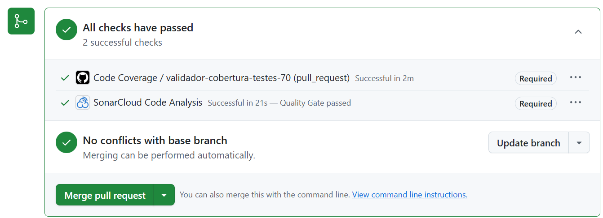

# 🍽️ Microserviço: Controle de Pedidos

Este repositório contém o microsserviço **Controle de Pedidos**, responsável pelo **gerenciamento de produtos e clientes** dentro do sistema distribuído de controle de pedidos.

## 📌 Funcionalidades

- Cadastro, atualização e exclusão de **produtos**
- Cadastro, atualização e exclusão de **clientes**
- Consulta de **produtos**, **clientes** e **categorias de produtos**
- Conexão com banco de dados **MySQL RDS da AWS**

---

## 🧱 Arquitetura

Este projeto faz parte de um sistema de **microsserviços**, divididos da seguinte forma:

| Microsserviço&nbsp;&nbsp;&nbsp;&nbsp;   | Descrição                                | Repositório | Cobertura de Testes |
|-----------------|--------------------------------------------|-------------|----------------------|
| 🍽️ Pedidos     | Gerenciamento de pedidos dos clientes     | [https://github.com/guilhermesd/servicopedidos](https://github.com/guilhermesd/servicopedidos) |  |
| 🧾 Pagamentos  | Processamento de pagamentos e faturas     | [https://github.com/guilhermesd/servicopagamentos](https://github.com/guilhermesd/servicopagamentos) |  |
| 👨‍🍳 Produção    | Controle de produção e estoque            | [https://github.com/guilhermesd/servicoproducao](https://github.com/guilhermesd/servicoproducao) |  |
| 🛠️ Gerenciador    | Cadastro e manutenção de clientes e produtos        | **(Este repositório)** |  |

## 🧩 Infraestrutura do Sistema

 Projetos de infraestrutura responsáveis por autenticação, banco de dados e orquestração via Kubernetes. Todos os recursos são provisionados utilizando **Terraform**:

| Repositório                                                                 | Descrição                                                                                                         |
|------------------------------------------------------------------------------|-------------------------------------------------------------------------------------------------------------------|
| 🔐 [pedidos-api-gateway-lambda](https://github.com/guilhermesd/pedidos-api-gateway-lambda) | Projeto Terraform que provisiona o API Gateway e uma função AWS Lambda para autenticação de clientes.            |
| 🗄️ [controlepedidosdb](https://github.com/guilhermesd/controlepedidosdb)                       | Projeto Terraform responsável por criar e gerenciar o banco de dados MySQL RDS usado pelo microsserviço de gerenciamento. |
| ☸️ [controlepedidosK8s](https://github.com/guilhermesd/controlepedidosK8s)                    | Projeto Terraform responsável pela infraestrutura de orquestração dos microsserviços com Kubernetes.             |

---

## ⚙️ Tecnologias Utilizadas

- ASP.NET Core 8
- Mysql
- Docker
- GitHub Actions (CI/CD)
- xUnit e Moq para testes
- OpenAPI (Swagger)

---

### ✅ Validações automáticas nos Pull Requests

Todo Pull Request enviado para a branch `main` passa por uma verificação automática via **GitHub Actions**, garantindo a qualidade e cobertura dos testes do código. Os seguintes checks são executados:

- ✅ **Code Coverage / validador-cobertura-testes-70**  
  Verifica se o projeto atinge no mínimo **70% de cobertura de testes automatizados**.  
  ✔️ *Status esperado: "Successful"*

- ✅ **SonarCloud Code Analysis**  
  Realiza a análise de qualidade estática do código usando **SonarCloud**, incluindo métricas como bugs, vulnerabilidades e code smells.  
  ✔️ *Status esperado: "Quality Gate passed"*

Esses checks são **obrigatórios** para permitir o _merge_ na `main`. Isso assegura que apenas códigos bem testados e com boa qualidade entram em produção.

#### 📸 Exemplo visual dos checks no GitHub:

---